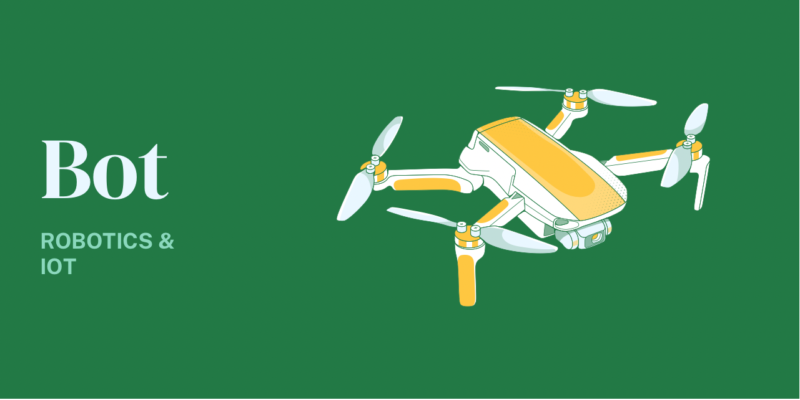

# Bot 🤖

> The bot package is a compilation of helper libraries for working with robotics in Go using GoBot

[](https://pkg.go.dev/github.com/open-farms/bot)



## What's inside? 📦

- Simple publish/subscribe for IoT. Control a network of bots with minimal boilerplate
- Robot controls for keyboard, gamepads, and more
- Utilities for working with sensors and addons via GPIO, I2C, and Serial buses

## Install

```
go get github.com/open-farms/bot
```

## Examples

View the examples [here](./examples)

More documentation can be found on [pkg.go.dev](https://pkg.go.dev/github.com/open-farms/bot)